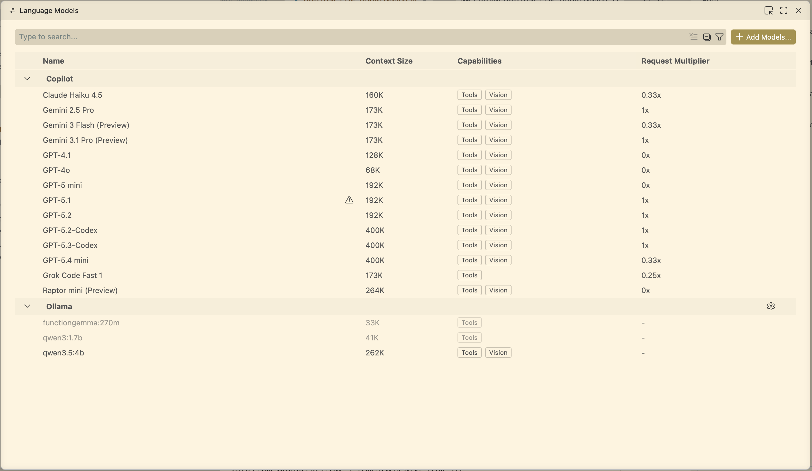

# Using Ollama as a Custom LLM Backend in VS Code Copilot Chat

This document describes how to use a local Ollama model with the built-in VS Code Copilot Chat UI (not Continue).

---

## 1. Install Ollama on macOS

Pick one of these options:

1. Download and install the desktop app (DMG) from https://ollama.com/download/mac. As of April 7, 2026, using the DMG installer may mitigate issues encountered with `brew install`.
2. Install via Homebrew:

```bash
brew install ollama
```

CLI reference:

* [Ollama CLI docs](https://docs.ollama.com/cli)

---

## 2. Pull the Model

```bash
ollama pull qwen3:1.7b
```

Note: the selected Ollama model must fit within your available RAM/VRAM. If the model is too large for your system, it will fail to start or crash during inference.

---

## 3. Start and Stop Ollama

Start the server:

```bash
ollama serve
```

Stop a running model:

```bash
ollama stop qwen3:1.7b
```

If you are running the Ollama desktop app, quit the app to stop the server.

---

## 4. Verify Ollama Works (Non-Tool Chat)

Quick CLI check:

```bash
ollama run qwen3:1.7b "Hello"
```

API check:

```bash
curl http://localhost:11434/api/version
```

Expected output contains the version, for example:

```json
{"version":"0.20.0"}
```

---

## 5. Add the Model in VS Code Copilot Chat

1. Open **Copilot Chat** in VS Code.
2. Open the model picker (the selector next to the agent name).
3. Click **Add Models…**
4. Choose **Ollama** as the provider.
5. Set the server URL:
   * Local VS Code (no dev container): `http://localhost:11434`
   * VS Code in a dev container: `http://host.docker.internal:11434`
6. Save, then select your Ollama model from the model picker.




CLI reference:

* [Ollama CLI docs](https://docs.ollama.com/cli)
